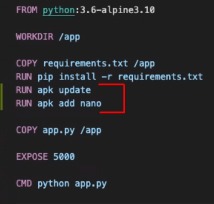

# Trabajo Práctico N° 2 y ejemplo de clase.
## ubp-docker-example

1. Agregar las variables de entorno necesarias para que la aplicacion "Flask" se conecte a MYSQL  
2. Agregar php my admin a este docker-compose, y agregar nuevos varietales en la tabla wines del esquema drinks  
3. Persistir el contenido de la base de datos mysql en disco  
4. Hostear dos contenedores con la aplicación flask en puertos diferentes en el host (no hay que cambiar la aplicación)  
5. Agregar al Dockerfile en ./app  la aplicación de linux "nano"

# Nota:
En los comentarios del file docker-compose.yml estan los puntos a resolver

------------------------------

# Documentación
1. Agregando las variables de entorno   
  

2. Agregando phpMyAdmin  
  
  
  

3. Persistiendo el contenido de la base de datos  
  

4. Hosteando dos contenedores  
  

5. Instalando nano  
  